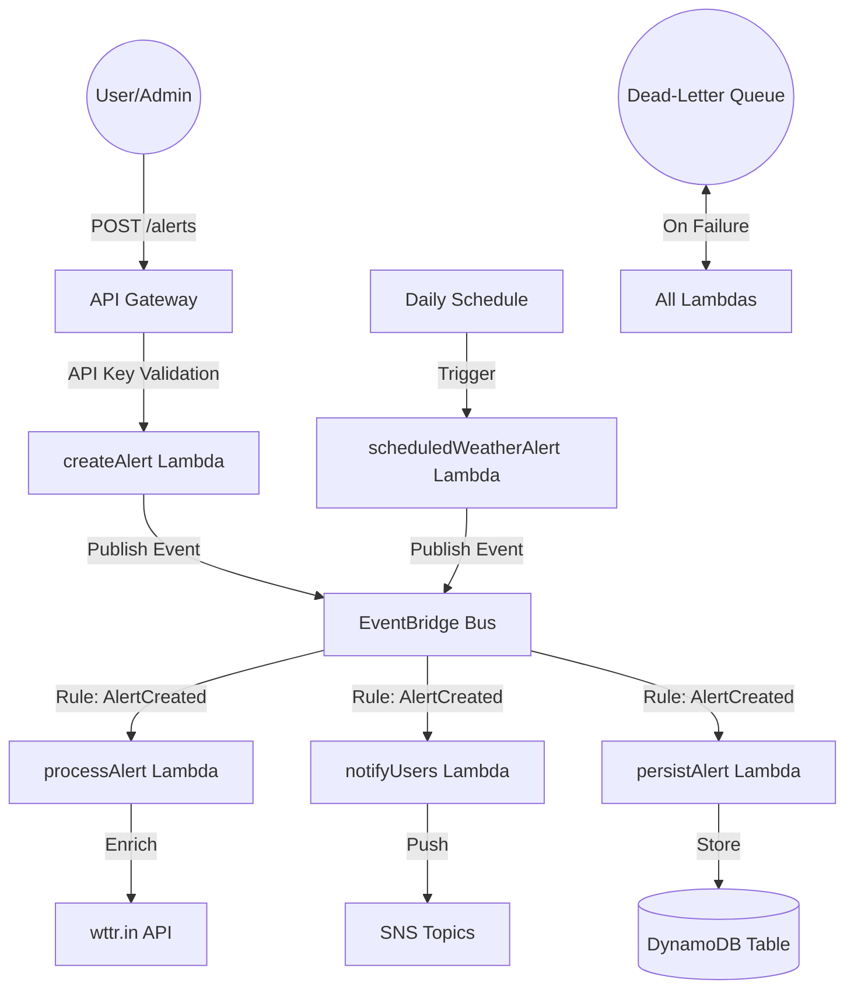
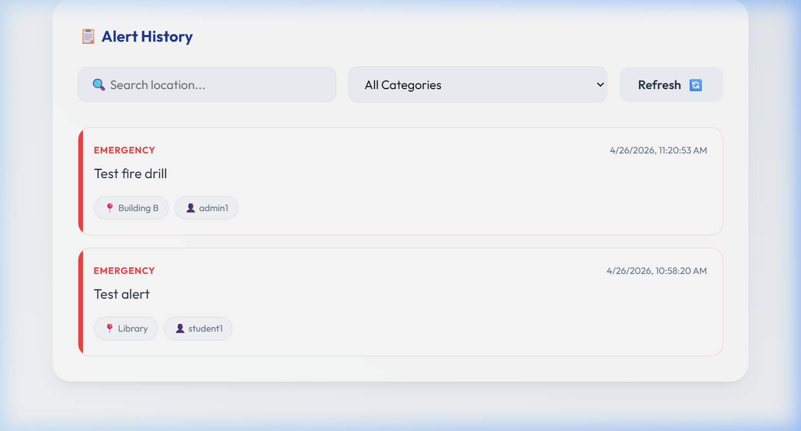
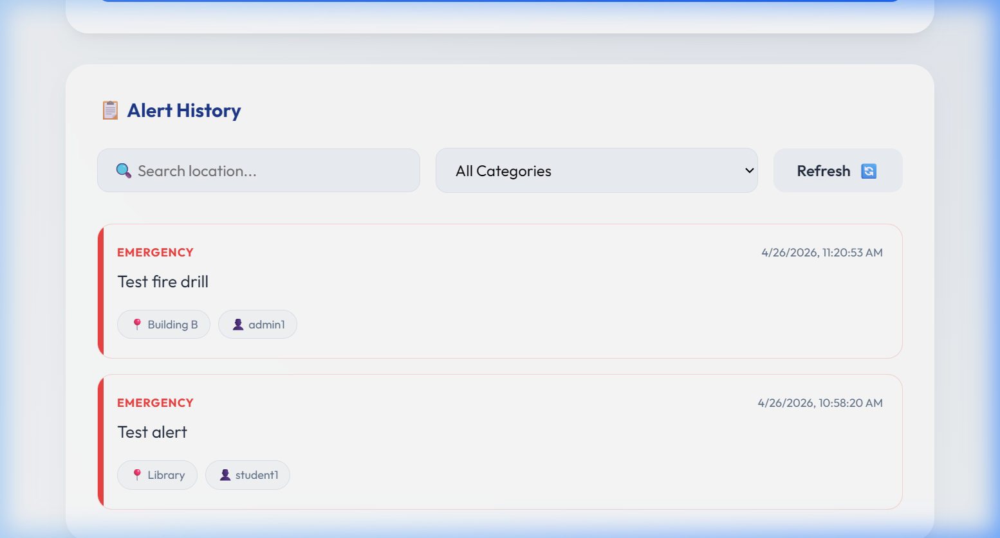

# 🏫 Smart Campus Alert System


## 🌟 Overview
The **Smart Campus Alert System** is a state-of-the-art, event-driven notification platform designed for modern educational institutions. It ensures real-time communication of critical information across the campus, from emergency alerts to facility updates, using a robust serverless architecture on AWS.

### 🚀 Key Features
- **Real-Time Broadcasting**: Instant delivery of emergency, weather, and facility alerts.
- **Event-Driven Architecture**: Decoupled processing using **AWS EventBridge** for high scalability.
- **Automated Weather Enrichment**: Every weather alert is automatically enriched with live conditions via the `wttr.in` API.
- **Smart Scheduling**: Daily automated weather updates broadcasted to the entire campus.
- **Secure API**: Protected by **API Key Authentication** to ensure only authorized personnel can broadcast alerts.
- **Reliability Guaranteed**: Integrated **Dead-Letter Queues (DLQ)** and CloudWatch monitoring to ensure no critical event is ever lost.
- **Premium Dashboard**: A sleek, responsive frontend built with modern design principles (Glassmorphism).

---

## 🏗️ Architecture
The system follows a reactive architecture to ensure maximum performance and maintainability.



---

## 📸 Screenshots

### 🖥️ Main Dashboard


### 📋 Alert History & Filtering


---

## 🛠️ Technology Stack
- **Backend**: Node.js, Serverless Framework
- **Infrastructure**: AWS (Lambda, EventBridge, DynamoDB, SNS, SQS, CloudWatch)
- **Frontend**: Vanilla HTML5, CSS3 (Glassmorphism), JavaScript
- **API**: RESTful API with Authentication

---

## 🚀 Getting Started

### Local Development (Mock Environment)
We have configured a comprehensive mock environment so you can develop without AWS credentials!

1. **Clone the repository**:
   ```bash
   git clone https://github.com/prompt-general/smart-campus-alert.git
   cd smart-campus-alert
   ```

2. **Setup Backend**:
   ```bash
   cd backend
   npm install
   npx serverless dynamodb install
   npx serverless offline start
   ```

3. **Open Frontend**:
   Open `frontend/index.html` in your browser.

### Cloud Deployment
To deploy to your AWS account:
```bash
cd backend
serverless deploy --apiKey "your-custom-api-key"
```

---

## 🛡️ Security
The API requires an `x-api-key` header for all broadcasting and retrieval operations. Ensure you rotate your production keys regularly.

## 📄 License
This project is licensed under the MIT License.
